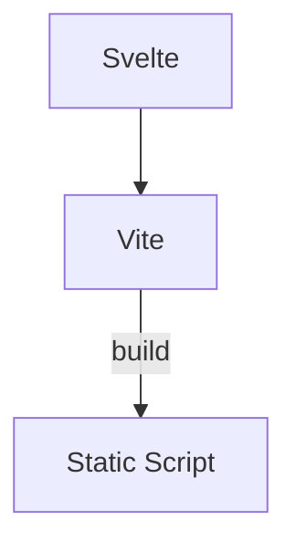
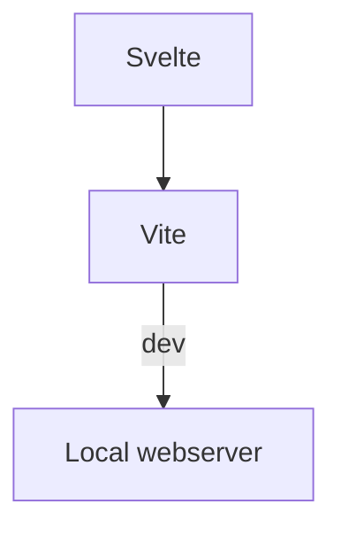

# Ballot page matcher

This is a project written in [Svelte](https://svelte.dev/) (not the related
SvelteKit) and built using [Vite](https://vitejs.dev/).

## What is Svelte?

Svelte is a component-based JavaScript framework for building user
interfaces. Unlike React or Vue, Svelte compiles the application into
vanilla JavaScript in a build step. The built asset is then stored on disk
for serving to users later. This results in a 'best of both worlds', with
'easy' JavaScript on for devs and small and fast bundles for users.

One reason to use Svelte here is the easy of maintaining a reactive system.

Variables in Svelte components are made reactive through assignments,
meaning that assigning a value to a variable will cause that variable to
update wherever it's used, instantly. e.g, updating `var count = 1` would
cause `<h1>the count is {cout}</h1>` to update without any additional code.

### Difference Between Svelte and SvelteKit

If you're researching Svelte apps you need to be careful to check if you're
actually reading about _SvelteKit_.

Svelte is a component framework, SvelteKit is a framework built on top of Svelte
designed for building more complex applications. SvelteKit provides a standard
structure for your application, adding features like server-side rendering,
static site generation, and file-based routing.

If you squint a bit you can think that Svelte is Flask and SvelteKit is
Django (although this is a bad analogy because SvelteKit and Svelte are
built and maintained by the same people and one is a superset of the other).

We don't use SvelteKit here because Django is taking care of routing (URLs)
and rendering pages for the most part. Svelte is acting like a 'widget'
embedded on a Django page.

### A note on CSS

A component in Svelte is self-contained. At compile time code is re-written 
with some optimizations.

A component can have a `<style>` tag in, but the styles only apply to 
elements in that component. `<style> a {color:red;}</style>` is valid and 
isn't going to make all links red, only those in the component.

This is neat for local modifications. Global styles are still applied and 
the design system / existing classes should be used where possible.

## What is Vite?

Vite is a front-end build tool that uses JavaScript's native module system (
ESM).

It provides a fast development environment with features like hot module
replacement (HMR). It optimizes the final build project for
production, and has a tonne of plugins for customising the built package.

We use Vite to turn Svelte in to JavaScript. The JavaScript is then served
by Django (from built files on disk, not any other magic) just like any
other JavaScript file would be.

## Compiling / Building



## Dev



You can use Vite in two ways: to compile the project to the `dist` directory
and to develop on the porject.

This is exposed by `npm` scripts in `package.json`. Invoke with `npm run
build` or `npm run dev`.

## Install

If you're just using the site locally, there should be no need to build this
project as the source is checked in.

If you want to develop it, change directory to the project root (the one
with this README in) and run `npm install` followed by `npm run dev`.

## Use

The app works on a single PDF and matched ballots to each page.

It requires some input props that define the PDF URL and the related ballots.

See the test data in `src/main.js` for this.

If pages have already been matched then the library supports this data being
passed in. Here is a full example:

```json 

{
  "sopn_pdf": "/media/official_documents/local.derbyshire-dales.2024-02-22/2024-03-31T15%3A23%3A45.641961%2B00%3A00/PCPRO-Volunteers-hack-together-UKs-digital-democracy-2022-09-14.pdf",
  "ballots": [
    {
      "ballot_paper_id": "local.derbyshire-dales.bakewell.by.2024-02-22",
      "label": "Bakewell",
      "matched": true,
      "matched_page": "1"
    },
    {
      "ballot_paper_id": "local.derbyshire-dales.norbury.by.2024-02-22",
      "label": "Norbury",
      "matched": true,
      "matched_page": "2"
    }
  ]
}

```

Note that `matched_page` is just the first page. Continuation pages are assumed.
