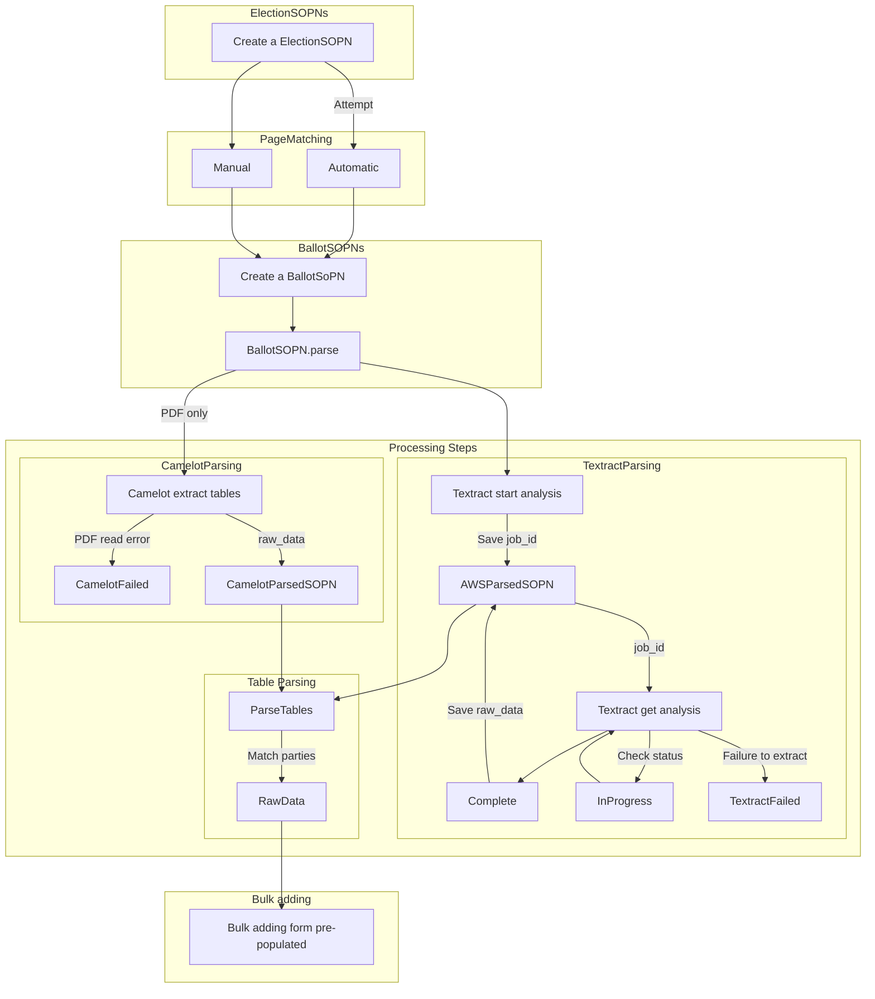

```mermaid
graph TD
    subgraph ElectionSOPNs
        ElectionSOPN[Create a ElectionSOPN]
    end

    subgraph PageMatching
        ElectionSOPN -- Attempt --> AutoPageMatching
        ElectionSOPN --> ManualPageMatching
    end


    subgraph BallotSOPNs
        AutoPageMatching[Automatic] --> BallotSOPN
        ManualPageMatching[Manual] --> BallotSOPN
        BallotSOPN[Create a BallotSoPN] --> ParseBallotSOPN[BallotSOPN.parse]
    end

    subgraph Processing Steps

        subgraph TextractParsing
            ParseBallotSOPN --> TextractStart[Textract start analysis]
            TextractStart -- Save job_id --> AWSParsedSOPN
            AWSParsedSOPN -- job_id --> TextractGetAnalysis[Textract get analysis]
            TextractGetAnalysis --> Complete -- Save raw_data --> AWSParsedSOPN
            TextractGetAnalysis -- Check status --> InProgress --> TextractGetAnalysis
            TextractGetAnalysis -- Failure to extract--> TextractFailed
        end

        subgraph CamelotParsing
            ParseBallotSOPN -- PDF only --> Camelot[Camelot extract tables]
            Camelot -- PDF read error--> CamelotFailed
            Camelot -- raw_data--> CamelotParsedSOPN

        end


        subgraph Table Parsing
            CamelotParsedSOPN --> ParseTables
            AWSParsedSOPN --> ParseTables
            ParseTables -- Match parties--> RawData
        end
        
    end
    
    subgraph Bulk adding
        RawData --> BulkAdding[Bulk adding form pre-populated]
    end
```
