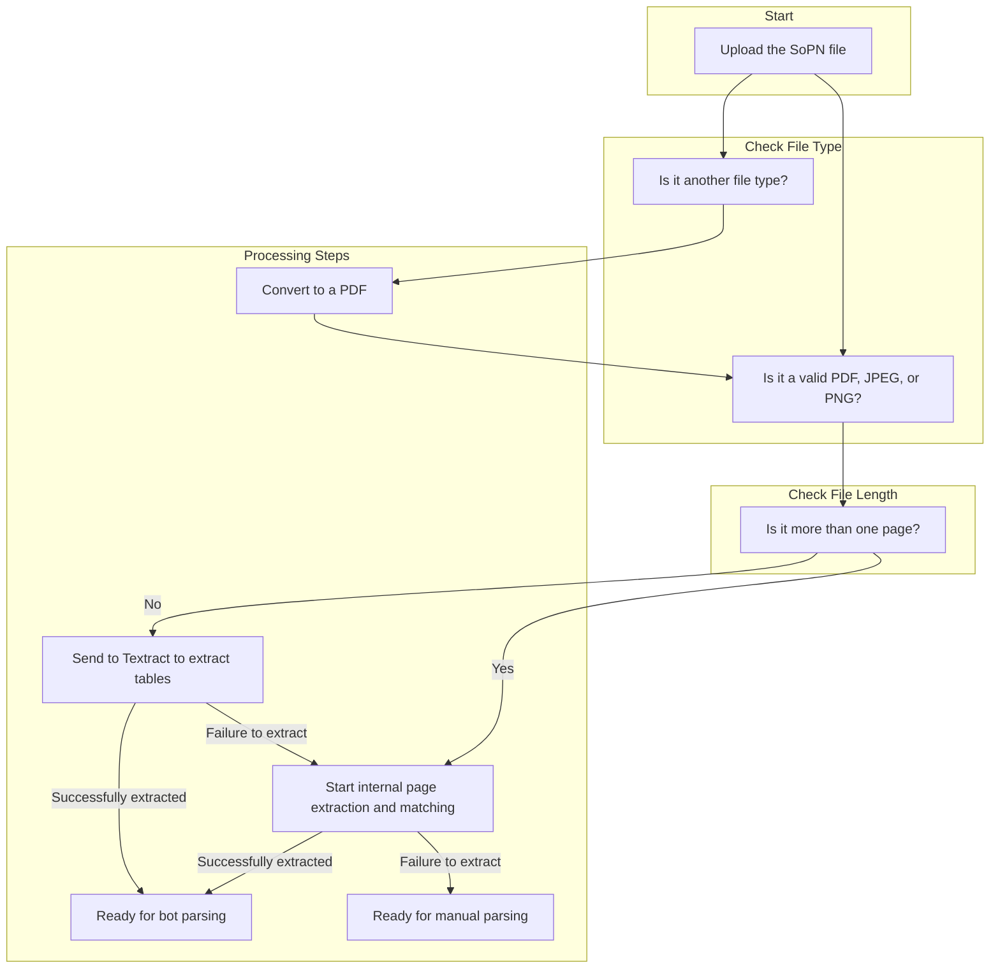

```mermaid
graph TD
    subgraph Start
  A[Upload the SoPN file]
end

subgraph Check File Type
  B[Is it a valid PDF, JPEG, or PNG?]
  C[Is it another file type?]
end

subgraph Check File Length
  D[Is it more than one page?]
end

subgraph Processing Steps
  E[Convert to a PDF]
  F[Send to Textract to extract tables]
  G[Start internal page extraction and matching]
  I[Ready for bot parsing]
  J[Ready for manual parsing]
  

end

A --> B
A --> C
B --> D
C --> E


D -->|Yes| G
D -->|No| F

E --> B
F --> |Failure to extract| G
F --> |Successfully extracted| I
G --> |Failure to extract| J
G --> |Successfully extracted|I


```